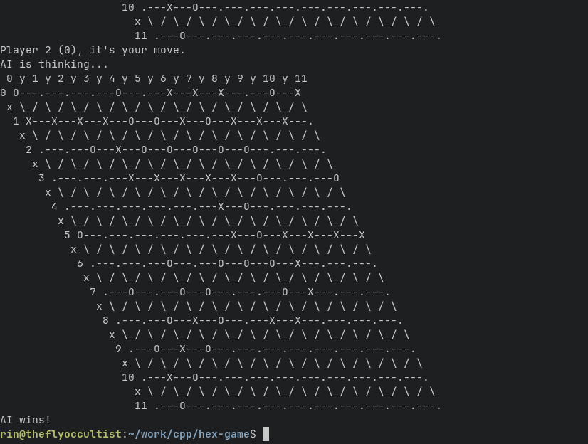

# hex-game
### Terminal Based hex-game with optional AI opponent.

- Phase 1: `hex_board.cpp`
  - Draw a dynamic Hex board
  - Take user input for board size and validate it
  - Validate legal moves
  - Check for winning conditions.

*At this phase, the game will be player as a human vs. human game.*

- Phase 2: `hex_board_evil_ai.cpp`
  - This Hex game contains an AI opponent that the human player most likely can't win against.
  - The AI player will always play second, and use a Monte Carlo simulation to evaluate winning moves.
  - Unfortunately bigger the board gets, the longer it will take time to think, which is why I have limited the board size.

This is the groundwork for future experiments in AI behavior, psychological manipulation, and deterministic torment.
